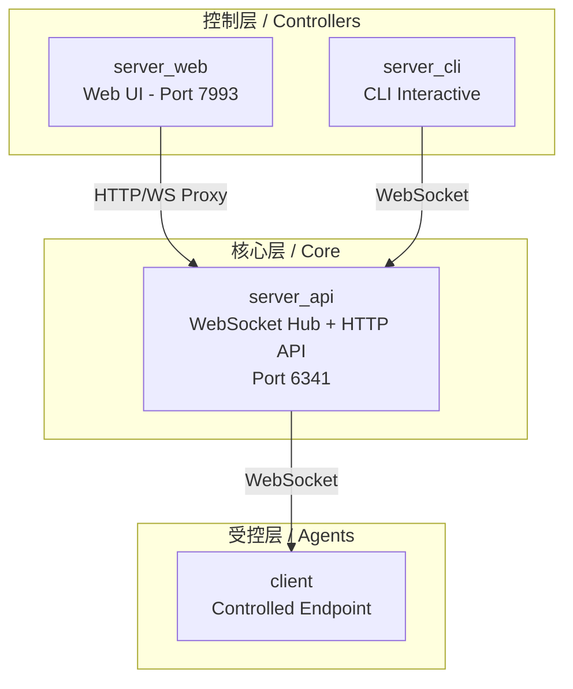
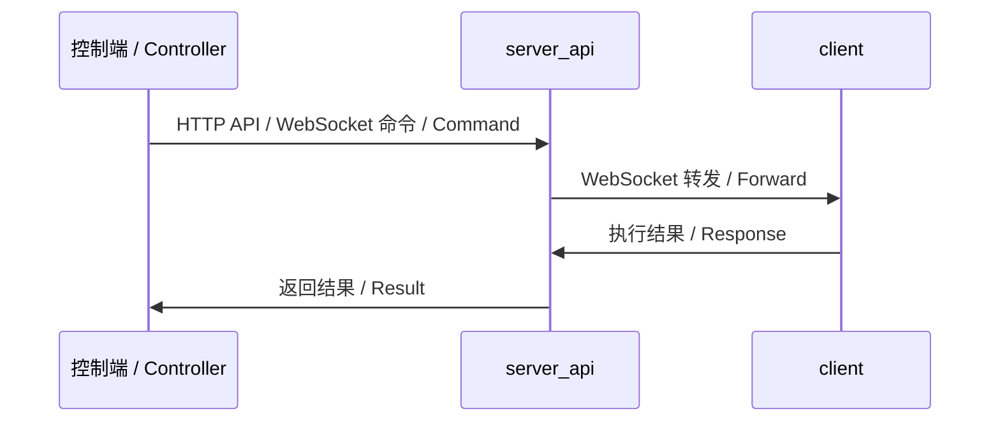

# RATFF - 远程控制工具框架 / Remote Access Tool Framework

基于 WebSocket 的远程控制软件框架，由受控端（client）和多个控制端（Web、CLI）组成，支持跨平台远程管理。

A WebSocket-based remote control software framework consisting of a client (controlled endpoint) and multiple controllers (Web, CLI), supporting cross-platform remote management.

## 功能 / Features

- **远程 Shell 执行** - 在远程客户端上执行 Shell 命令
- **文件管理** - 浏览、上传、下载、移动、复制和删除文件
- **屏幕截图** - 从远程客户端捕获屏幕截图
- **系统信息** - 查看已连接客户端的详细系统信息
- **多控制端** - 通过 Web 界面或 CLI 进行控制
- **跨平台** - 支持 Linux、macOS 和 Windows
- **安全** - TLS/WSS 传输加密、JWT 认证、路径密码保护、速率限制
- **高可用** - 指数退避自动重连、心跳保活

| Feature | Description |
|---------|-------------|
| **Remote Shell Execution** | Execute shell commands on remote clients |
| **File Management** | Browse, upload, download, move, copy, and delete files |
| **Screen Capture** | Capture screenshots from remote clients |
| **System Information** | View detailed system info of connected clients |
| **Multi-Controller** | Control via Web interface or CLI |
| **Cross-Platform** | Supports Linux, macOS, and Windows |
| **Secure** | TLS/WSS transport, JWT authentication, path password protection, rate limiting |
| **Resilient** | Auto-reconnect with exponential backoff, heartbeat keep-alive |

## 项目结构 / Project Structure

| 目录 / Directory | 说明 / Description |
|------------------|-------------------|
| `client/` | 受控端代理（运行在被控设备上）/ Client agent (controlled endpoint) |
| `server_api/` | 核心 API 服务器（WebSocket + HTTP API）/ Core API server |
| `server_web/` | Web 控制端（浏览器界面）/ Web controller (browser-based UI) |
| `server_cli/` | CLI 交互式控制端（终端界面）/ CLI controller (interactive terminal) |
| `shared/` | 共享库（协议、工具、国际化）/ Shared library (protocol, utils, i18n) |
| `docs/` | 文档 / Documentation |

## 快速开始 / Quick Start

### 环境要求 / Prerequisites

- Go 1.26.5 或更高版本 / Go 1.26.5 or later
- Linux / macOS / Windows

### 构建 / Build

```bash
# 构建所有组件 / Build all components
go build -o bin/client ./client
go build -o bin/server_api ./server_api
go build -o bin/server_web ./server_web
go build -o bin/server_cli ./server_cli
```

### 运行 / Run

#### 1. 启动 API 服务器 / Start the API Server

```bash
# 基础模式（开发环境）/ Basic (development)
./bin/server_api

# 带路径密码保护 / With path password protection
LOGIN_PATH=mypath LOGIN_PASSWORD_HASH=$(htpasswd -bnBC 12 "" yourpassword | tr -d ':\n') ./bin/server_api

# 带 TLS 加密 / With TLS
TLS_CERT=cert.pem TLS_KEY=key.pem ./bin/server_api
```

#### 2. 启动 Web 控制端（可选）/ Start the Web Controller (optional)

```bash
API_URL=http://127.0.0.1:6341 WS_URL=ws://127.0.0.1:6341 ./bin/server_web
```

然后在浏览器中打开 `http://localhost:7993`。

Then open `http://localhost:7993` in your browser.

#### 3. 启动 CLI 控制端（可选）/ Start the CLI Controller (optional)

```bash
./bin/server_cli
```

系统会提示输入路径密码和登录密码。

You will be prompted for the path password and login password.

#### 4. 运行受控端 / Run the Client Agent

```bash
# 连接本地服务器 / Connect to local server
SERVER_HOST=127.0.0.1 SERVER_PORT=6341 ./bin/client

# 带路径密码连接 / Connect with path password
SERVER_HOST=127.0.0.1 SERVER_PORT=6341 PATH_PASSWORD=mypath ./bin/client
```

### 环境变量 / Environment Variables

| 变量 / Variable | 组件 / Component | 默认值 / Default | 说明 / Description |
|-----------------|------------------|------------------|-------------------|
| `HOST` | server_api, server_web | `0.0.0.0` | 绑定地址 / Bind address |
| `PORT` | server_api | `6341` | API 服务器端口 / API server port |
| `PORT` | server_web | `7993` | Web 服务器端口 / Web server port |
| `PATH_PASSWORD` | server_api, client | `` | URL 路径密码 / URL path password |
| `LOGIN_PASSWORD_HASH` | server_api | (default) | Bcrypt 加密的登录密码 / Bcrypt-hashed login password |
| `JWT_SECRET` | server_api | (default) | JWT 签名密钥 / JWT signing secret |
| `API_URL` | server_web | `http://127.0.0.1:6341` | 后端 API 地址 / Backend API URL |
| `WS_URL` | server_web | `ws://127.0.0.1:6341` | 后端 WebSocket 地址 / Backend WebSocket URL |
| `TLS_CERT` | server_api | `` | TLS 证书路径 / TLS certificate path |
| `TLS_KEY` | server_api | `` | TLS 密钥路径 / TLS key path |
| `APP_ENV` | all | `debug` | 运行环境（debug/production）/ Environment |

## 架构 / Architecture



**通信流程 / Communication Flow:**



- **server_api** 监听 6341 端口，通过 WebSocket 管理客户端连接，提供 HTTP API 端点。
- **server_web** 监听 7993 端口，提供基于 Vue.js 的 Web 界面，代理 API 请求到 server_api。
- **server_cli** 是交互式 CLI 工具，通过 WebSocket 连接 server_api 进行终端控制。
- **client** 通过 WebSocket 连接 server_api，注册自身并执行来自控制端的命令。

- **server_api** listens on port 6341, manages client connections via WebSocket, and provides HTTP API endpoints.
- **server_web** listens on port 7993, provides a Vue.js-based web UI, and proxies API requests to server_api.
- **server_cli** is an interactive CLI tool that connects to server_api via WebSocket for terminal-based control.
- **client** connects to server_api via WebSocket, registers itself, and executes commands received from controllers.

## 许可证 / License

MIT