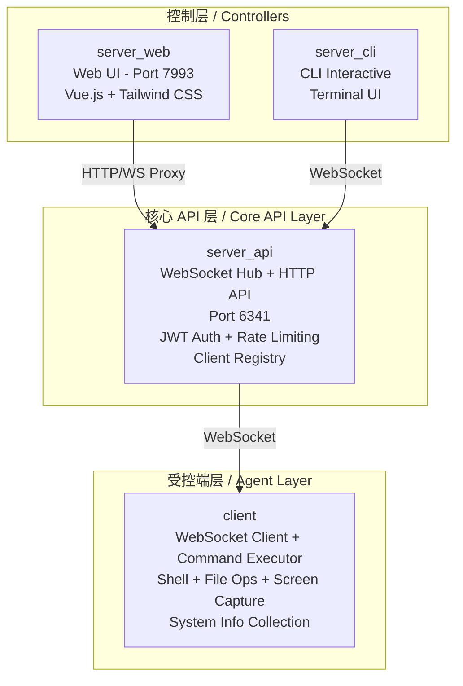
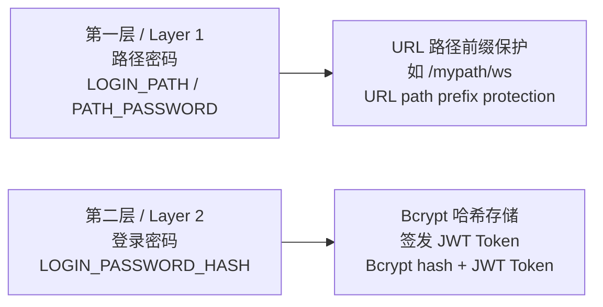
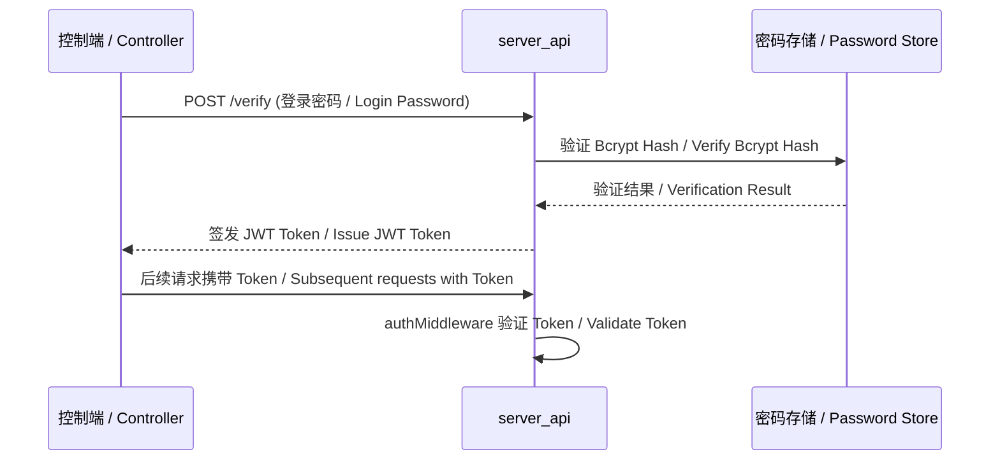
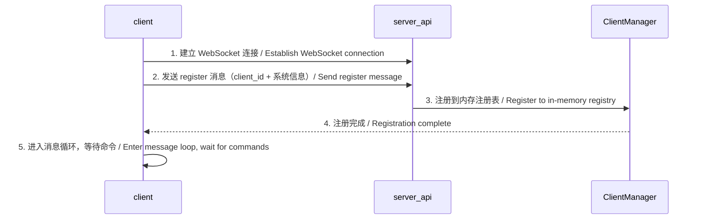
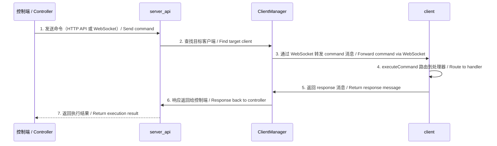
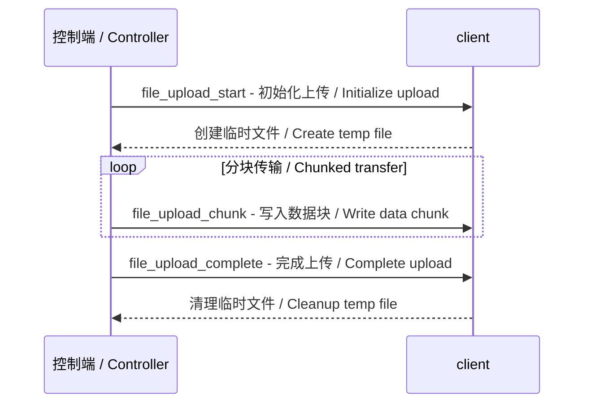
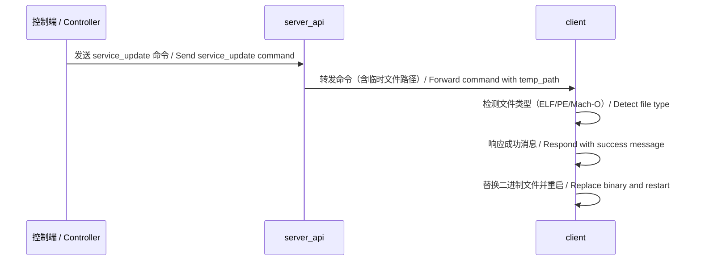
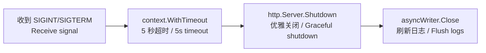

# RATFF 技术架构文档 / Technical Architecture

基于 WebSocket 的远程控制软件框架，由受控端（client）和多个控制端（Web/CLI）组成，支持跨平台远程管理。

A WebSocket-based remote control software framework consisting of a client (controlled endpoint) and multiple controllers (Web/CLI), supporting cross-platform remote management.

## 1. 项目概述 / Project Overview

### 1.1 核心设计目标 / Core Design Goals

| 目标 / Goal | 说明 / Description |
|-------------|-------------------|
| **模块化架构 / Modular Architecture** | server_api 作为核心枢纽，server_web 和 server_cli 作为独立控制端 / server_api as core hub, server_web and server_cli as independent controllers |
| **协议统一 / Unified Protocol** | 所有组件通过 shared 库共享统一的 JSON 消息协议 / All components share a unified JSON message protocol via the shared library |
| **安全优先 / Security First** | 双层密码保护、JWT 认证、TLS 传输加密、速率限制 / Two-layer password protection, JWT auth, TLS encryption, rate limiting |
| **高可用性 / High Availability** | 指数退避重连、心跳保活、优雅关闭、并发安全 / Exponential backoff reconnect, heartbeat keep-alive, graceful shutdown, concurrency safety |

### 1.2 部署架构 / Deployment Architecture



## 2. 通信协议 / Communication Protocol

### 2.1 消息格式 / Message Format

所有组件之间通过 JSON 格式的消息进行通信：

All components communicate via JSON-formatted messages:

```json
{
  "id": "uuid",
  "type": "register|heartbeat|command|response|error",
  "command": "screen_capture|shell_exec|file_list|...",
  "client_id": "client-uuid",
  "payload": {},
  "timestamp": 1234567890
}
```

### 2.2 消息类型 / Message Types

| 类型 / Type | 说明 / Description | 方向 / Direction |
|-------------|-------------------|------------------|
| `register` | 客户端注册，携带系统信息 / Client registration with system info | client → server |
| `heartbeat` | 心跳保活（Ping/Pong）/ Heartbeat keep-alive | 双向 / Bidirectional |
| `command` | 控制命令 / Control command | server → client |
| `response` | 执行结果 / Execution result | client → server |
| `error` | 错误信息 / Error message | 双向 / Bidirectional |

### 2.3 命令类型 / Command Types

| 命令 / Command | 说明 / Description |
|----------------|-------------------|
| `shell_exec` | 执行 Shell 命令（同步）/ Execute shell command (synchronous) |
| `shell_exec_bg` | 后台执行 Shell 命令 / Execute shell command in background |
| `system_info` | 获取系统信息 / Get system information |
| `screen_capture` | 屏幕截图 / Screen capture |
| `file_list` | 列出目录文件 / List directory files |
| `file_upload` | 上传文件（分块）/ Upload file (chunked) |
| `file_upload_start` | 初始化文件上传 / Initialize file upload |
| `file_upload_chunk` | 上传文件分块 / Upload file chunk |
| `file_upload_complete` | 完成文件上传 / Complete file upload |
| `file_download` | 下载文件（分块）/ Download file (chunked) |
| `file_download_start` | 初始化文件下载 / Initialize file download |
| `file_download_chunk` | 下载文件分块 / Download file chunk |
| `file_download_complete` | 完成文件下载 / Complete file download |
| `file_move` | 移动文件 / Move file |
| `file_copy` | 复制文件 / Copy file |
| `file_delete` | 删除文件 / Delete file |
| `cd` | 切换工作目录 / Change working directory |
| `pwd` | 获取当前目录 / Get current directory |
| `public_ip` | 获取公网 IP 及地理位置 / Get public IP and geolocation |
| `service_update` | 远程更新客户端 / Remote update client |
| `exit` | 退出客户端 / Exit client |

### 2.4 心跳机制 / Heartbeat Mechanism

| 参数 / Parameter | 值 / Value |
|------------------|-----------|
| **Ping 间隔 / Ping Interval** | 30 秒 / 30 seconds |
| **Pong 超时 / Pong Timeout** | 60 秒 / 60 seconds |
| **实现 / Implementation** | 自定义心跳：`SetupSafeHeartbeat` 使用 `time.Ticker` 定时发送 Ping / Custom heartbeat: `SetupSafeHeartbeat` uses `time.Ticker` to send Ping |
| **并发安全 / Concurrency Safety** | `WSConn.WriteMessage` 使用 `sync.Mutex` 保证写入安全 / `WSConn.WriteMessage` uses `sync.Mutex` for write safety |
| **超时处理 / Timeout Handling** | PongHandler 重置 ReadDeadline，超时自动断开连接 / PongHandler resets ReadDeadline, timeout auto-disconnects |

## 3. 安全架构 / Security Architecture

### 3.1 双层密码保护 / Two-Layer Password Protection



| 层级 / Layer | 机制 / Mechanism | 说明 / Description |
|--------------|-----------------|-------------------|
| **第一层 / Layer 1** | 路径密码 / Path Password | URL 路径前缀保护，通过 `LOGIN_PATH`（server_api）或 `PATH_PASSWORD`（client）配置 / URL path prefix, configured via `LOGIN_PATH` (server_api) or `PATH_PASSWORD` (client) |
| **第二层 / Layer 2** | 登录密码 / Login Password | Bcrypt 哈希存储，通过 `LOGIN_PASSWORD_HASH` 配置，登录成功后签发 JWT Token / Bcrypt hashed via `LOGIN_PASSWORD_HASH`, JWT Token issued after login |

**各组件认证方式 / Authentication Methods by Component**：

| 组件 / Component | 认证方式 / Auth Method | 说明 / Description |
|------------------|----------------------|-------------------|
| **client** | 路径密码 | 通过 `PATH_PASSWORD` 环境变量配置，连接时附加到 URL / Via `PATH_PASSWORD` env var, appended to URL on connect |
| **server_cli** | 终端输入 | 启动时通过 `term.ReadPassword` 交互式输入路径密码和登录密码 / Interactive input via `term.ReadPassword` on startup |
| **server_web** | Cookie + 路径密码 | 通过 Cookie 存储 JWT Token，路径密码通过 URL 前缀或 Cookie 传递 / JWT Token in Cookie, path password via URL prefix or Cookie |

**环境变量配置 / Environment Variables**：

| 变量 / Variable | 组件 / Component | 默认值 / Default | 说明 / Description |
|-----------------|------------------|------------------|-------------------|
| `LOGIN_PATH` | server_api | `` | URL 路径密码 / URL path password |
| `PATH_PASSWORD` | client | `` | URL 路径密码 / URL path password |
| `LOGIN_PASSWORD_HASH` | server_api | (default) | Bcrypt 加密的登录密码 / Bcrypt-hashed login password |
| `JWT_SECRET` | server_api | (default) | JWT 签名密钥 / JWT signing secret |
| `LANGUAGE` | server_cli | `en` | 界面语言（en/zh）/ UI language |

### 3.2 认证流程 / Authentication Flow



### 3.3 速率限制 / Rate Limiting

| 类型 / Type | 速率 / Rate | 适用范围 / Scope |
|-------------|------------|-----------------|
| **全局限流 / Global Rate Limit** | 50 req/s | 非 API 端点（WebSocket 升级、验证端点）/ Non-API endpoints (WS upgrade, verify) |
| **客户端限流 / Per-Client Rate Limit** | 10000 req/s，burst 2000 | API 端点（命令执行、文件操作）/ API endpoints (command execution, file operations) |

**设计说明 / Design Notes**：
- 全局限流使用 `rate.NewLimiter(rate.Every(time.Second), 50)` / Global uses `rate.NewLimiter(rate.Every(time.Second), 50)`
- 客户端限流使用 `rate.NewLimiter(rate.Every(time.Millisecond/10), 2000)`，支持约 640MB/s 文件传输（64KB 分块）/ Per-client uses `rate.NewLimiter(rate.Every(time.Millisecond/10), 2000)`, supports ~640MB/s file transfer (64KB chunks)
- 自动清理：30 分钟未使用的限流器会被移除 / Auto-cleanup: limiters unused for 30 minutes are removed

### 3.4 TLS 支持 / TLS Support

- **server_api** 支持 TLS：通过环境变量 `TLS_CERT` 和 `TLS_KEY` 启用 / **server_api** supports TLS: Enable via environment variables
- 无证书时自动降级为普通 WebSocket 并记录警告 / Auto-degrade to plain WebSocket with warning if no certificate
- 生产环境下未配置 TLS 将拒绝启动 / Production environment refuses to start without TLS
- **server_web** 不支持 TLS（建议通过反向代理配置）/ **server_web** does not support TLS (recommend configuring via reverse proxy)

## 4. 各模块详细设计 / Module Design Details

### 4.1 shared（共享库 / Shared Library）

**职责 / Responsibility**：提供所有组件共享的基础设施 / Provide shared infrastructure for all components

| 文件 / File | 职责 / Responsibility |
|-------------|----------------------|
| `protocol.go` | 消息结构体、类型枚举、消息工厂函数 / Message struct, type enums, factory functions |
| `ws_utils.go` | WebSocket 连接封装、心跳机制、安全读写 / WebSocket wrapper, heartbeat, safe read/write |
| `utils.go` | 日志初始化（支持异步）、UUID 生成、AES-GCM 加密、优雅关闭 / Logger init (async support), UUID generation, AES-GCM encryption, graceful shutdown |
| `client_info.go` | 客户端信息收集（OS、主机名、IP）、重连退避计算 / Client info collection (OS, hostname, IP), reconnect backoff calculation |
| `ip_geo.go` | 公网 IP 地理位置查询（智能字段映射）/ Public IP geolocation lookup (smart field mapping) |
| `translations.go` | i18n 多语言支持（嵌入文件系统）/ i18n multi-language support (embedded filesystem) |
| `logo_selector.go` | Logo 选择器（根据环境选择不同 Logo）/ Logo selector (selects different logos based on environment) |
| `rate_limiter.go` | 全局限流、每客户端限流、自动清理 / Global rate limiting, per-client rate limiting, auto-cleanup |

### 4.2 client（受控端 / Client Agent）

**职责 / Responsibility**：运行在被控设备上，接收并执行命令 / Runs on target device, receives and executes commands

| 文件 / File | 职责 / Responsibility |
|-------------|----------------------|
| `main.go` | 连接管理、注册、消息循环、重连逻辑 / Connection management, registration, message loop, reconnect |
| `config.go` | 环境变量配置加载 / Environment variable configuration loading |
| `handler.go` | 命令路由、Shell 执行、目录切换 / Command routing, shell execution, directory change |
| `file_handler.go` | 文件上传/下载分块处理 / File upload/download chunk handling |
| `file_operations.go` | 文件列表、移动、复制、删除操作 / File list, move, copy, delete operations |
| `screen_capture.go` | 屏幕截图功能 / Screen capture functionality |
| `systeminfo_handler.go` | 系统信息收集 / System information collection |
| `public_ip_handler.go` | 公网 IP 及地理位置查询 / Public IP and geolocation lookup |
| `service_update.go` | 远程更新客户端（自动检测文件类型、替换并重启）/ Remote client update (auto-detect file type, replace and restart) |

**重连策略 / Reconnect Strategy**：指数退避算法，初始 1 秒，最大 30 秒 / Exponential backoff, initial 1s, max 30s

**远程更新机制 / Remote Update Mechanism**：
- 通过 `service_update` 命令触发 / Triggered via `service_update` command
- 自动检测文件类型（ELF/PE/Mach-O）/ Auto-detect file type (ELF/PE/Mach-O)
- 仅支持可执行文件 / Only executable files supported
- 响应成功后替换二进制并重启 / Replace binary and restart after success response
- Windows 使用批处理脚本，Unix 使用直接替换 / Windows uses batch script, Unix uses direct replacement

### 4.3 server_api（核心 API 服务器 / Core API Server）

**职责 / Responsibility**：WebSocket Hub + HTTP API，管理所有客户端连接 / WebSocket Hub + HTTP API, manages all client connections

| 文件 / File | 职责 / Responsibility |
|-------------|----------------------|
| `main.go` | Gin 路由配置、TLS 启动、优雅关闭 / Gin routing, TLS startup, graceful shutdown |
| `config.go` | 环境变量配置加载、安全警告 / Environment config loading, security warnings |
| `manager.go` | 客户端注册表、命令分发、广播 / Client registry, command dispatch, broadcast |
| `handler.go` | WebSocket 处理、HTTP API 端点 / WebSocket handling, HTTP API endpoints |
| `auth.go` | JWT 认证中间件、密码验证 / JWT auth middleware, password verification |
| `http_handlers.go` | 验证端点、客户端列表端点 / Verify endpoint, client list endpoint |

**端口 / Port**：默认 6341 / Default 6341

**关键中间件 / Key Middleware**：

| 中间件 / Middleware | 功能 / Function |
|---------------------|----------------|
| `authMiddleware` | JWT Token 验证 / JWT Token verification |
| `GlobalRateLimitMiddleware` | 全局限流 50 req/s / Global rate limiting 50 req/s |
| `PerClientRateLimitMiddleware` | 每客户端限流 10000 req/s，burst 2000 / Per-client rate limiting 10000 req/s, burst 2000 |

### 4.4 server_web（Web 控制端 / Web Controller）

**职责 / Responsibility**：提供浏览器-based 的图形化控制界面 / Provides browser-based graphical control interface

| 文件 / File | 职责 / Responsibility |
|-------------|----------------------|
| `main.go` | Gin 路由配置（支持路径密码前缀）、静态资源、模板渲染 / Gin routing (with path password prefix support), static resources, template rendering |
| `config.go` | 环境变量配置加载 / Environment variable configuration loading |
| `handlers.go` | HTTP 处理器：登录、API 代理、文件操作代理、路径密码前缀路由 / Login, API proxy, file operation proxy, path password prefix routing |
| `auth.go` | Cookie 认证、通过 server_api 验证密码、登录/登出 / Cookie auth, password verification via server_api, login/logout |
| `websocket.go` | WebSocket 代理（连接 server_api）/ WebSocket proxy (connects to server_api) |
| `websocket_proxy.go` | WebSocket 双向消息转发 / WebSocket bidirectional message forwarding |
| `file_transfer.go` | 文件上传/下载代理、分块传输、MD5 校验 / File upload/download proxy, chunked transfer, MD5 verification |
| `task_manager.go` | 异步任务管理（进度跟踪、SSE 推送）/ Async task management (progress tracking, SSE push) |
| `translator.go` | i18n 翻译中间件 / i18n translation middleware |

**端口 / Port**：默认 7993 / Default 7993

**前端技术栈 / Frontend Tech Stack**：

| 技术 / Technology | 用途 / Purpose |
|-------------------|---------------|
| Vue 3 | 响应式 UI 框架 / Reactive UI framework |
| Tailwind CSS | 原子化 CSS 框架 / Utility-first CSS framework |
| 自研 i18n / Custom i18n | 多语言支持（中/英）/ Multi-language support (CN/EN) |

### 4.5 server_cli（CLI 控制端 / CLI Controller）

**职责 / Responsibility**：交互式命令行控制工具 / Interactive command-line control tool

| 文件/目录 / File/Directory | 职责 / Responsibility |
|---------------------------|----------------------|
| `main.go` | 主循环、终端密码输入（`term.ReadPassword`）、模式切换 / Main loop, terminal password input (`term.ReadPassword`), mode switching |
| `config.go` | 配置加载（HOST、PORT、LANGUAGE）/ Configuration loading (HOST, PORT, LANGUAGE) |
| `translator.go` | i18n 翻译 / i18n translation |
| `types.go` | 类型定义 / Type definitions |
| `wrappers.go` | 打印函数封装 / Print function wrappers |
| `helpers.go` | 提示符构建、模式处理 / Prompt building, mode handling |
| `api/` | API 客户端封装（认证、WebSocket、HTTP 请求）/ API client wrapper (auth, WebSocket, HTTP requests) |
| `client/` | 客户端操作（列表、选择、命令执行、文件传输、屏幕截图、系统信息、公网 IP、远程更新）/ Client operations (list, select, command execution, file transfer, screen capture, system info, public IP, remote update) |
| `output/` | 格式化输出（表格、系统信息渲染、样式、帮助）/ Formatted output (tables, system info rendering, styles, help) |
| `lang/` | 语言包（en.json, zh.json）/ Language packs |

**交互模式 / Interaction Modes**：

| 模式 / Mode | 提示符 / Prompt | 可用命令 / Available Commands |
|-------------|----------------|------------------------------|
| **Server 模式** | `(server) >>` | list, select, delete, exit |
| **Console 模式** | `(<id>)(console) >>` | command, cd, bg, exit, back |
| **Command 模式** | `(<id>)(command) >>` | 直接输入命令执行 / Direct command input |

**语言配置 / Language Configuration**：
- 通过 `LANGUAGE` 环境变量设置，默认 `en` / Set via `LANGUAGE` env var, default `en`
- 支持 `en`（英文）和 `zh`（中文）/ Supports `en` (English) and `zh` (Chinese)

**密码输入方式 / Password Input Method**：
- 启动时通过 `term.ReadPassword` 交互式输入路径密码和登录密码 / Interactive input via `term.ReadPassword` on startup
- 密码不通过环境变量传递，确保安全性 / Passwords not passed via env vars for security

## 5. 文件结构 / File Structure

```
RATFF/
├── client/                   # 受控端（被控设备运行）/ Client agent (runs on target device)
│   ├── main.go               # 入口：连接、注册、消息循环、重连 / Entry: connect, register, message loop, reconnect
│   ├── config.go             # 配置：HOST, PORT, PATH_PASSWORD / Config
│   ├── handler.go            # 命令路由：shell_exec, cd, pwd, exit / Command routing
│   ├── file_handler.go       # 文件上传/下载分块处理 / File upload/download chunk handling
│   ├── file_operations.go    # 文件操作：list, move, copy, delete / File operations
│   ├── screen_capture.go     # 屏幕截图 / Screen capture
│   ├── systeminfo_handler.go # 系统信息收集 / System info collection
│   ├── public_ip_handler.go  # 公网 IP 及地理位置查询 / Public IP and geolocation lookup
│   ├── service_update.go     # 远程更新客户端 / Remote client update
│   └── *_test.go             # 单元测试 / Unit tests
│
├── server_api/               # 核心 API 服务器 / Core API server
│   ├── main.go               # 入口：Gin 路由、TLS、优雅关闭 / Entry: Gin routing, TLS, graceful shutdown
│   ├── config.go             # 配置：HOST, PORT, LOGIN_PATH, LOGIN_PASSWORD_HASH, JWT_SECRET / Config
│   ├── manager.go            # 客户端管理器：注册、注销、发送命令 / Client manager: register, unregister, send commands
│   ├── handler.go            # WebSocket 处理、HTTP API 端点 / WebSocket handling, HTTP API endpoints
│   ├── auth.go               # JWT 认证、密码验证 / JWT auth, password verification
│   ├── http_handlers.go      # 验证端点、客户端列表 / Verify endpoint, client list
│   └── *_test.go             # 单元测试 / Unit tests
│
├── server_web/               # Web 控制端 / Web controller
│   ├── main.go               # 入口：Gin 路由（支持路径密码前缀）、静态资源、模板 / Entry: Gin routing (with path prefix support), static resources, templates
│   ├── config.go             # 配置：HOST, PORT, API_URL, WS_URL / Config
│   ├── handlers.go           # HTTP 处理器：登录、API 代理、文件操作、路径密码路由 / HTTP handlers: login, API proxy, file ops, path prefix routing
│   ├── auth.go               # Cookie 认证、通过 server_api 验证密码、登录/登出 / Cookie auth, password verification via server_api, login/logout
│   ├── websocket.go          # WebSocket 代理 / WebSocket proxy
│   ├── websocket_proxy.go    # WebSocket 双向转发 / WebSocket bidirectional forwarding
│   ├── file_transfer.go      # 文件传输代理、分块传输、MD5 校验 / File transfer proxy, chunked transfer, MD5 verification
│   ├── task_manager.go       # 异步任务管理、SSE 进度推送 / Async task management, SSE progress push
│   ├── translator.go         # i18n 翻译中间件 / i18n translation middleware
│   ├── static/               # 静态资源 / Static resources
│   │   └── js/               # Vue 3, Tailwind, i18n 消息 / i18n messages
│   ├── templates/            # HTML 模板 / HTML templates
│   │   ├── index.html        # 主界面 / Main interface
│   │   └── login.html        # 登录页 / Login page
│   ├── lang/                 # 语言包 / Language packs
│   └── *_test.go             # 单元测试 / Unit tests
│
├── server_cli/               # CLI 控制端 / CLI controller
│   ├── main.go               # 入口：终端密码输入、交互循环 / Entry: terminal password input, interactive loop
│   ├── config.go             # 配置：HOST, PORT, LANGUAGE / Config
│   ├── translator.go         # i18n 翻译 / i18n translation
│   ├── types.go              # 类型定义 / Type definitions
│   ├── wrappers.go           # 打印函数封装 / Print function wrappers
│   ├── helpers.go            # 提示符、模式处理 / Prompt, mode handling
│   ├── api/                  # API 客户端封装 / API client wrapper
│   │   ├── auth.go           # 登录认证 / Login authentication
│   │   ├── client_api.go     # HTTP API 请求 / HTTP API requests
│   │   └── websocket.go      # WebSocket 连接管理 / WebSocket connection management
│   ├── client/               # 客户端操作 / Client operations
│   │   ├── mgmt.go           # 客户端管理（列表、选择、删除）/ Client management (list, select, delete)
│   │   ├── operations.go     # 命令执行 / Command execution
│   │   ├── shell.go          # Shell 交互 / Shell interaction
│   │   ├── upload.go         # 文件/文件夹上传 / File/folder upload
│   │   ├── download.go       # 文件/文件夹下载 / File/folder download
│   │   ├── screen_capture.go # 屏幕截图 / Screen capture
│   │   ├── systeminfo.go     # 系统信息 / System info
│   │   ├── public_ip.go      # 公网 IP 及地理位置 / Public IP and geolocation
│   │   └── update.go         # 远程更新客户端 / Remote client update
│   ├── output/               # 格式化输出 / Formatted output
│   │   ├── table.go          # 表格渲染 / Table rendering
│   │   ├── styles.go         # 样式定义（lipgloss）/ Style definitions (lipgloss)
│   │   ├── help.go           # 帮助信息输出 / Help information output
│   │   └── systeminfo_render.go # 系统信息渲染 / System info rendering
│   └── lang/                 # 语言包（en.json, zh.json）/ Language packs
│
├── shared/                   # 共享库 / Shared library
│   ├── protocol.go           # 消息协议定义 / Message protocol definitions
│   ├── ws_utils.go           # WebSocket 工具 / WebSocket utilities
│   ├── utils.go              # 通用工具 / General utilities
│   ├── client_info.go        # 客户端信息 / Client info
│   ├── ip_geo.go             # IP 地理位置 / IP geolocation
│   ├── translations.go       # i18n 翻译 / i18n translation
│   ├── logo_selector.go      # Logo 选择器 / Logo selector
│   ├── rate_limiter.go       # 速率限制器 / Rate limiter
│   └── *_test.go             # 单元测试 / Unit tests
│
├── docs/                     # 文档 / Documentation
│   ├── architecture/         # 技术架构文档（本目录）/ Technical architecture docs (this directory)
│   ├── requirements/         # 需求文档 / Requirements docs
│   ├── tasks/                # 任务计划 / Task plans
│   ├── dev-rules/            # 开发规范 / Development rules
│   ├── ai-prompts/           # AI 提示词 / AI prompts
│   └── completed-tasks/      # 已完成任务记录 / Completed task records
│
├── go.mod                    # Go 模块定义 / Go module definition
├── go.sum                    # 依赖校验 / Dependency checksums
├── .gitignore                # Git 忽略规则 / Git ignore rules
└── SECURITY.md               # 安全策略 / Security policy
```

## 6. 技术栈 / Technology Stack

### 6.1 后端（Go）/ Backend (Go)

| 库 / Library | 用途 / Purpose |
|--------------|---------------|
| `github.com/gin-gonic/gin` | HTTP 框架，高并发、成熟稳定 / HTTP framework, high concurrency, mature and stable |
| `github.com/gorilla/websocket` | WebSocket 连接，广泛使用 / WebSocket connection, widely used |
| `github.com/sirupsen/logrus` | 生产级结构化日志 / Production-grade structured logging |
| `github.com/golang-jwt/jwt/v5` | JWT Token 认证 / JWT Token authentication |
| `golang.org/x/crypto/bcrypt` | 密码加密 / Password hashing |
| `golang.org/x/term` | 终端密码输入掩码 / Terminal password input masking |
| `golang.org/x/time/rate` | 请求速率限制 / Request rate limiting |
| `github.com/google/uuid` | UUID 生成 / UUID generation |
| `github.com/shirou/gopsutil/v3` | 系统信息收集 / System information collection |
| `github.com/kbinani/screenshot` | 屏幕截图 / Screen capture |
| `github.com/charmbracelet/lipgloss` | CLI 终端样式 / CLI terminal styling |
| `github.com/google/shlex` | Shell 命令解析 / Shell command parsing |
| `github.com/stretchr/testify` | 测试断言 / Test assertions |

### 6.2 前端（server_web）/ Frontend (server_web)

| 技术 / Technology | 用途 / Purpose |
|-------------------|---------------|
| Vue 3 | 响应式 UI 框架 / Reactive UI framework |
| Tailwind CSS | 原子化 CSS 框架 / Utility-first CSS framework |
| 自研 i18n / Custom i18n | 多语言支持（中/英）/ Multi-language support (CN/EN) |

### 6.3 通信协议 / Communication Protocols

| 协议 / Protocol | 用途 / Purpose |
|-----------------|---------------|
| WebSocket | 长连接双向通信 / Long-lived bidirectional communication |
| HTTP/JSON | RESTful API |
| TLS/WSS | 传输层加密 / Transport layer encryption |

## 7. 关键实现细节 / Key Implementation Details

### 7.1 客户端注册流程 / Client Registration Flow



1. 客户端启动，通过环境变量获取服务器地址和路径密码 / Client starts, gets server address and path password from environment variables
2. 建立 WebSocket 连接到 `ws://host:port/path/ws` / Establish WebSocket connection
3. 发送 `register` 消息，携带 `client_id` 和系统信息 / Send `register` message with `client_id` and system info
4. server_api 的 `ClientManager` 将客户端注册到内存注册表 / `ClientManager` registers client to in-memory registry
5. 客户端进入消息循环，等待接收命令 / Client enters message loop, waits for commands

### 7.2 命令执行流程 / Command Execution Flow



1. 控制器（Web/CLI）通过 HTTP API 或 WebSocket 发送命令 / Controller sends command via HTTP API or WebSocket
2. server_api 的 `ClientManager` 查找目标客户端 / `ClientManager` finds target client
3. 通过 WebSocket 将 `command` 消息发送给客户端 / Send `command` message to client via WebSocket
4. 客户端的 `executeCommand` 函数根据命令类型路由到对应处理器 / `executeCommand` routes to handler by command type
5. 处理器执行完成后返回 `response` 消息 / Handler returns `response` message after execution
6. server_api 将响应返回给控制器 / server_api returns response to controller

### 7.3 文件传输（分块机制）/ File Transfer (Chunked Mechanism)

文件上传和下载采用分块传输机制，避免大文件占用过多内存，支持文件夹递归传输：

File upload and download use chunked transfer mechanism to avoid large files consuming too much memory, with folder recursive transfer support:

**上传流程 / Upload Flow**：



| 步骤 / Step | 命令 / Command | 说明 / Description |
|-------------|---------------|-------------------|
| 1 | `file_upload_start` | 初始化上传，创建临时文件 / Initialize upload, create temp file |
| 2 | `file_upload_chunk` | 分块写入数据 / Write data in chunks |
| 3 | `file_upload_complete` | 完成上传，清理临时文件 / Complete upload, cleanup temp file |

**下载流程 / Download Flow**：

| 步骤 / Step | 命令 / Command | 说明 / Description |
|-------------|---------------|-------------------|
| 1 | `file_download_start` | 初始化下载，获取文件大小 / Initialize download, get file size |
| 2 | `file_download_chunk` | 分块读取文件数据 / Read file data in chunks |
| 3 | `file_download_complete` | 完成下载，清理资源 / Complete download, cleanup resources |

**文件夹传输 / Folder Transfer**：

| 方向 / Direction | 实现方式 / Implementation |
|------------------|--------------------------|
| **上传文件夹 / Upload Folder** | CLI 层使用 `filepath.Walk` 递归遍历，对每个文件调用单文件上传 / CLI uses `filepath.Walk` to recursively traverse, calls single file upload for each file |
| **下载文件夹 / Download Folder** | CLI 层先探测远程路径类型，递归遍历远程目录，逐个下载 / CLI detects remote path type first, recursively traverses remote directory, downloads each file |
| **Web 上传文件夹 / Web Upload Folder** | 使用 `webkitRelativePath` 保留目录结构 / Uses `webkitRelativePath` to preserve directory structure |
| **Web 下载文件夹 / Web Download Folder** | 递归下载并打包为 ZIP / Recursively downloads and packages as ZIP |

### 7.4 并发安全 / Concurrency Safety

| 资源 / Resource | 保护机制 / Protection |
|-----------------|----------------------|
| WebSocket 写入 / WebSocket writes | `sync.Mutex` |
| 客户端注册表 / Client registry | `sync.RWMutex` |
| 工作目录 / Working directory | `sync.RWMutex` |
| Channel 发送 / Channel sends | `select { default: }` 防止阻塞 / Prevent blocking |

### 7.4.1 远程更新机制 / Remote Update Mechanism

远程更新允许通过控制端更新被控端的客户端程序：

Remote update allows updating the client agent on the controlled endpoint via controllers:



**文件类型检测 / File Type Detection**：

| 类型 / Type | 魔数 / Magic Number | 平台 / Platform |
|-------------|---------------------|-----------------|
| **PE** | `MZ` (0x4D, 0x5A) | Windows |
| **ELF** | `0x7f ELF` | Linux |
| **Mach-O** | `0xFEEDFACF` / `0xCEFAEDFE` | macOS |

**重启策略 / Restart Strategy**：

| 平台 / Platform | 方法 / Method |
|-----------------|--------------|
| **Windows** | 批处理脚本：等待进程退出 → 替换文件 → 启动新进程 / Batch script: wait for process exit → replace file → start new process |
| **Linux/macOS** | Unix 方法：`os.Rename` 替换 → `exec.Command` 重启 / Unix method: `os.Rename` to replace → `exec.Command` to restart |

**安全限制 / Security Constraints**：
- 仅接受可执行文件 / Only executable files accepted
- 响应成功后才替换二进制 / Binary replacement only after success response
- 后台异步执行替换和重启 / Replacement and restart executed asynchronously in background

### 7.5 优雅关闭 / Graceful Shutdown



- 监听 `SIGINT` 和 `SIGTERM` 信号 / Listen for `SIGINT` and `SIGTERM` signals
- 使用 `context.WithTimeout` 设置关闭超时 / Use `context.WithTimeout` for shutdown timeout
- 调用 `http.Server.Shutdown()` 优雅关闭 HTTP 服务 / Call `http.Server.Shutdown()` for graceful shutdown
- 客户端收到 `exit` 命令后调用 `os.Exit(0)` 退出 / Client calls `os.Exit(0)` on `exit` command
- **server_api** 和 **server_web** 使用 `shared.GracefulShutdown` / **server_api** and **server_web** use `shared.GracefulShutdown`
- **client** 使用独立的信号处理器 / **client** uses independent signal handler

### 7.6 日志系统 / Logging System

| 特性 / Feature | 说明 / Description |
|----------------|-------------------|
| **框架 / Framework** | `logrus` 结构化日志 / Structured logging |
| **级别 / Levels** | `info`, `warn`, `error`, `debug` |
| **异步写入 / Async Write** | `AsyncWriter` 实现异步日志，缓冲区 10000 条消息 / Async log writing with 10000 message buffer |
| **格式 / Format** | 所有组件默认使用 `text` 格式 / All components default to `text` format |
| **初始化 / Initialization** | `InitLoggerWithWriter` 统一初始化，返回 logger 和 asyncWriter / Unified init via `InitLoggerWithWriter`, returns logger and asyncWriter |
| **关闭处理 / Shutdown** | `asyncWriter.Close()` 刷新剩余日志 / `asyncWriter.Close()` flushes remaining logs |

## 8. 工程规范 / Engineering Standards

### 8.1 代码规范 / Code Standards

| 规范 / Standard | 要求 / Requirement |
|-----------------|-------------------|
| 单文件行数 / File line limit | 不超过 150 行（测试文件不超过 300 行）/ Max 150 lines (test files max 300 lines) |
| 职责划分 / Responsibility | 单一职责原则，每个文件职责清晰 / Single responsibility, clear file职责 |
| 库选择 / Library choice | 优先使用标准库和成熟第三方库 / Prefer standard library and mature third-party libraries |
| 错误处理 / Error handling | 所有错误必须检查，禁止静默忽略 / All errors must be checked, no silent ignoring |
| 代码检查 / Code linting | 使用 `golangci-lint` 进行代码检查 / Use `golangci-lint` for code checking |

### 8.2 测试规范 / Testing Standards

| 规范 / Standard | 要求 / Requirement |
|-----------------|-------------------|
| 单元测试 / Unit tests | 每个模块必须有单元测试 / Every module must have unit tests |
| 断言库 / Assertion library | 使用 `github.com/stretchr/testify` / Use `github.com/stretchr/testify` |
| 文件命名 / File naming | 测试文件以 `_test.go` 结尾 / Test files end with `_test.go` |

### 8.3 文档规范 / Documentation Standards

| 目录 / Directory | 内容 / Content |
|------------------|---------------|
| `docs/requirements/` | 需求文档 / Requirements docs |
| `docs/tasks/` | 任务计划 / Task plans |
| `docs/dev-rules/` | 开发规范 / Development rules |
| `docs/completed-tasks/` | 已完成任务记录 / Completed task records |
| `docs/ai-prompts/` | AI 提示词 / AI prompts |

## 9. 国际化（i18n）/ Internationalization

项目支持多语言，目前支持中文和英文：

The project supports multiple languages, currently Chinese and English:

| 组件 / Component | 实现方式 / Implementation |
|------------------|--------------------------|
| **server_cli** | 通过 `lang/en.json` 和 `lang/zh.json` 加载翻译 / Load translations via language packs |
| **server_web** | 通过 `lang/en.json` 和 `lang/zh.json` 加载翻译 / Load translations via language packs |
| **shared** | 通过 `translations.go` 提供通用翻译功能 / Provide general translation via `translations.go` |
| **前端 / Frontend** | 自研 i18n 消息系统，通过 `messages.js` 管理翻译 / Custom i18n system via `messages.js` |

## 10. 扩展方向 / Future Extensions

| 方向 / Direction | 说明 / Description |
|------------------|-------------------|
| **更多命令类型 / More Commands** | 进程管理、服务管理、网络诊断等 / Process management, service management, network diagnostics |
| **客户端分组 / Client Grouping** | 客户端分组和批量操作 / Client grouping and batch operations |
| **审计日志 / Audit Log** | 命令执行历史记录和审计 / Command execution history and audit |
| **前端增强 / Frontend Enhancement** | 终端模拟器、文件管理器、任务调度 / Terminal emulator, file manager, task scheduling |
| **数据持久化 / Data Persistence** | 数据库持久化客户端信息 / Database persistence for client information |
| **插件系统 / Plugin System** | 插件系统支持自定义命令 / Plugin system for custom commands |